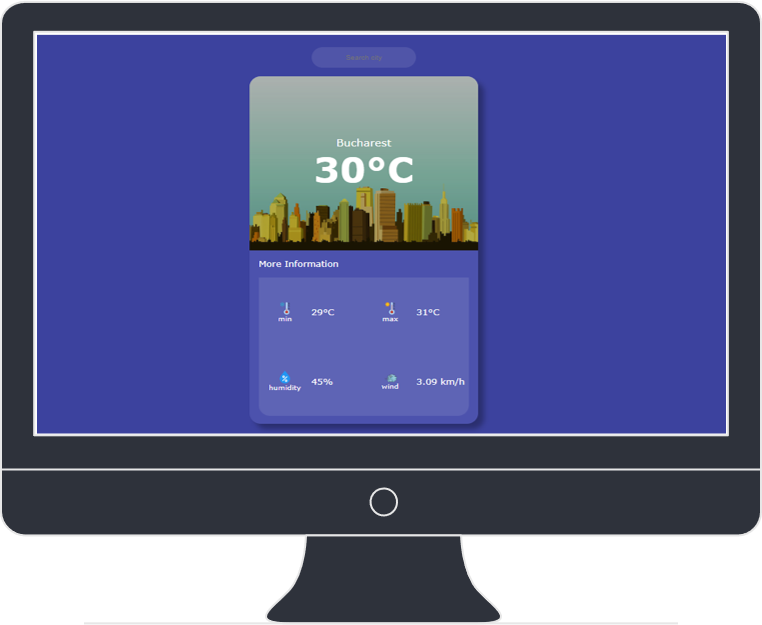

This project showcases an end-to-end Continuous Integration and Continuous Deployment (CI/CD) pipeline for a weather application developed using Angular, Docker, and Jenkins. The primary goal of this project is to streamline the software delivery process, ensuring rapid and efficient deployment of the weather application.

Project Overview
Angular Application: Short Angular project generated with Angular CLI version 16.1.0 consisting in a weather-web-based-application.
I designed and developed an interactive weather application, providing users with real-time weather information for various locations.

  

https://rapidapi.com/KirylBokiy/api/openweather43/ -> Api from RapidApi used for weather host

Dockerized Deployment: To ensure seamless deployment and portability, the Angular application is containerized using Docker, allowing it to run consistently across different environments.

Git & GitHub Version Control: We used Git as the version control system to manage the project's source code, collaborating through GitHub, where the repository is hosted.

Jenkins Automation: Jenkins plays a pivotal role in automating the CI/CD pipeline. It builds the Angular application, performs code quality checks, and deploys the application using Docker.

GitHub Validation Tags: We use GitHub validation tags to mark significant milestones in the codebase's history, signifying successful validations or deployments.

Future Development: The project's scope includes potential further development, such as integrating a database for weather history, using Kubernetes for container orchestration, and creating Selenium tests for robust UI validation.